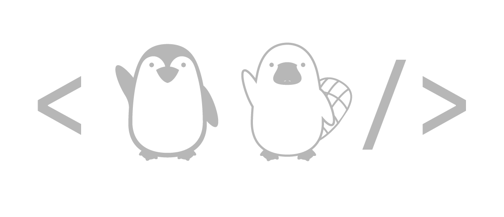

# This is PennApps

PennApps is the world's original college hackathon. Since 2009, we've hosted events for hackers from around the world. At our weekend-long hackathons, both beginners and experts work together, learn, and compete to become better engineers and create awesome projects. Find out more about us at [pennapps.com](https://pennapps.com/).

Here on our GitHub, you'll find the source code to some of the websites you'll interact with before and throughout the hackathon. Please contact [audrey@pennapps.com](mailto:audrey@pennapps.com) or file an issue in the repositories if you would like to leave any feedback.
